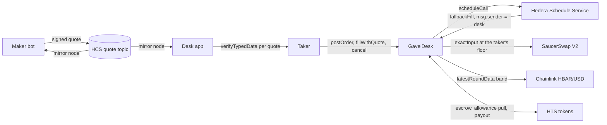
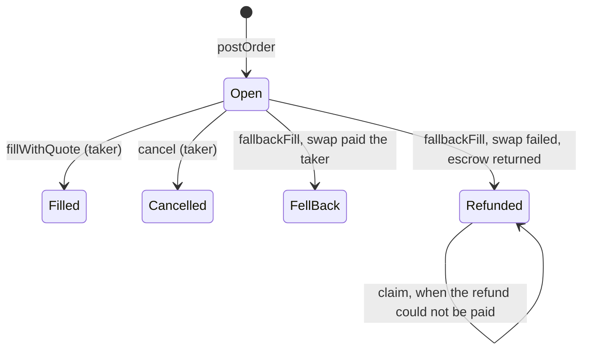
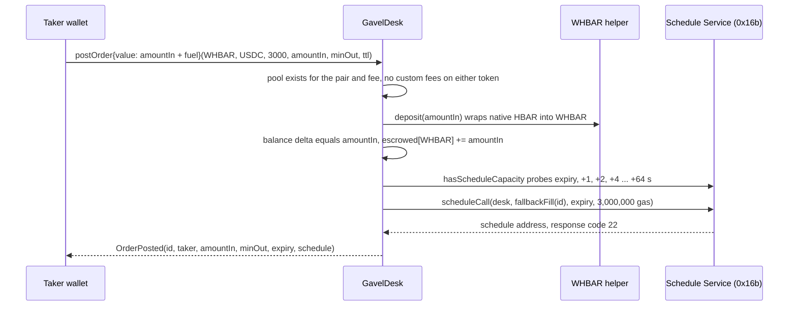
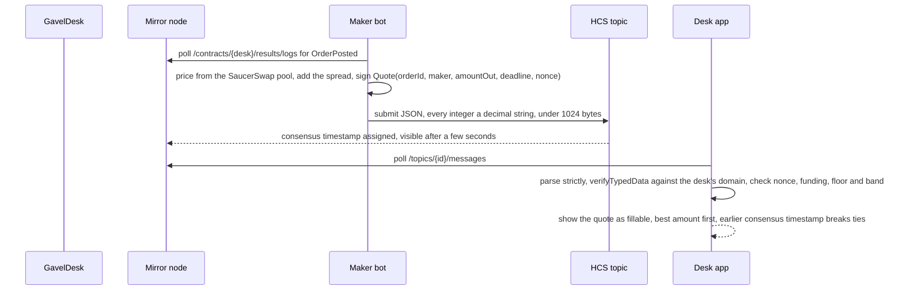
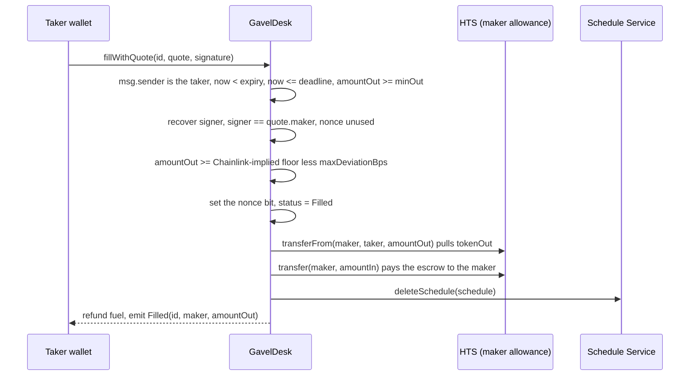
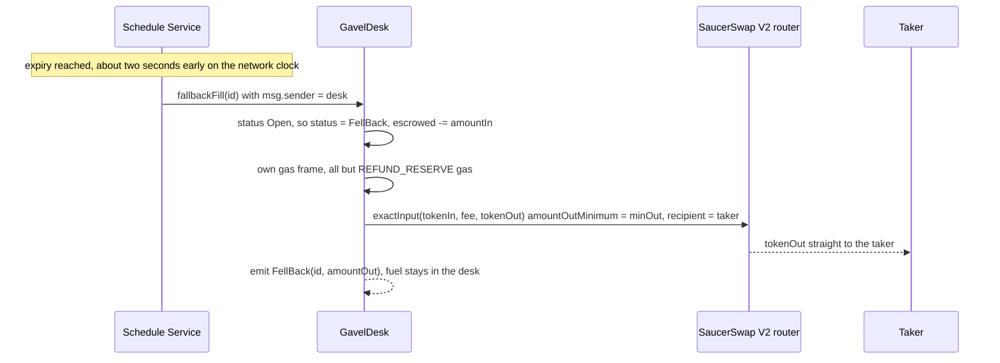
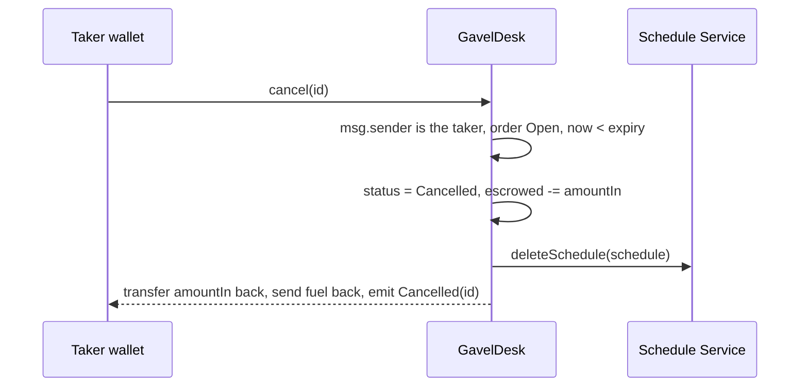

# Architecture

Gavel is one contract, `GavelDesk`, three off-chain readers of one public topic, and a Next.js desk. There is no owner, no admin key and no fee: nothing moves escrow except the paths below.

## Who can call what

| Function | Caller | Effect |
| --- | --- | --- |
| `postOrder(tokenIn, tokenOut, fee, amountIn, minOut, ttl)` | anyone | Escrows `amountIn`, takes fuel, books `fallbackFill(id)` for `expiry`, emits `OrderPosted` |
| `fillWithQuote(id, quote, signature)` | the order's taker only | Verifies the maker's EIP-712 signature, nonce, deadline, floor and Chainlink band, swaps escrow for the maker's tokens, deletes the schedule, refunds fuel |
| `cancel(id)` | the order's taker only, before expiry | Returns escrow and fuel, deletes the schedule |
| `fallbackFill(id)` | the desk itself (the Schedule Service) | Swaps the escrow on SaucerSwap at the taker's `minOut`, straight to the taker; refunds on failure; never reverts after the caller check |
| `claim(id)` | the order's taker | Pays an escrow a failed refund parked, once the taker is associated |
| `rearm(id)` | anyone, `RETRY_GRACE` after expiry, at most `MAX_REARMS` times | Books a fresh fallback for an order the first schedule did not settle |
| `cancelNonces(wordPos, mask)` | a maker | Retires up to 256 signed quotes in one transaction |
| `associateTokens(tokens)` | anyone | Associates the desk with HTS tokens through HIP-719 |

## Order state

`getOrder(id).status` is the only source of truth the app and the evidence script read.

## Flow 1: post an order

The floor `minOut` is the taker's own number. It bounds every quote and the fallback swap. A schedule the network refuses reverts the post (`ScheduleFailed`), so no order exists without a booked fallback.

## Flow 2: a maker quotes over HCS

The EIP-712 domain is `{name: "Gavel", version: "1", chainId: 296, verifyingContract: desk}`. A quote that fails any check is shown with its reason and has no Accept button. The topic has no submit key, so it is a public board: anyone can post junk, and a quote is only worth what its signature and the desk's checks make it worth.

## Flow 3: the taker fills

Both legs move in one transaction or neither does. The nonce bit is set only on this path, so a fill that reverts, for example when the maker is short of allowance, does not burn the quote.

## Flow 4: nobody quotes, the network runs the fallback

If the swap fails, `fallbackFill` sets `Refunded`, returns the escrow to the taker, and parks it as `claimable` if even that transfer fails. A settled order is skipped with `FallbackSkipped`. The transaction shows `scheduled: true` on the mirror node and the desk as payer; no human sends it.

## Flow 5: the taker cancels

The deleted schedule reads `deleted: true` on the mirror node. A deleted schedule never runs, and a stale one that still fires finds the order settled and skips it.

## Invariants the tests hold

`GavelInvariant.t.sol` runs the desk against a handler that posts, fills, cancels, runs the fallback and claims at random, and asserts after every call:

- escrow per token equals open orders plus unclaimed refunds, and the desk's token balance equals it;
- native HBAR in the desk equals open-order fuel plus the fuel fallbacks kept;
- every open order has a live schedule, and a settled order stays settled;
- the scheduled path never reverts.

`test_handlerReachesEveryAction` proves the handler actually reaches each action, so the invariants are not satisfied by an idle run. The list of invariants a contributor must keep is in [AGENTS.md](../AGENTS.md).

## Off-chain pieces

| Piece | Path | Role |
| --- | --- | --- |
| Maker bot | `scripts/maker/` | Watches `OrderPosted`, signs quotes with `MAKER_PRIVATE_KEY`, posts them to the topic |
| Quote signer | `packages/foundry/scripts-js/sign-quote.mjs` | Signs one quote and prints the HCS wire JSON, used by the live script |
| HCS helper | `packages/foundry/scripts-js/hcs.mjs` | Creates the topic and submits messages with `@hiero-ledger/sdk` |
| Desk app | `packages/nextjs/` | Posts orders, reads the board from the mirror node, verifies every quote client-side, accepts and cancels |
| Evidence check | `scripts/verify-evidence.sh` | Re-reads the testnet run from chain, 13 rows of PASS or FAIL |

## Units

HBAR is tinybar inside the EVM (8 decimals) and weibar at the JSON-RPC layer (18). WHBAR has 8 decimals, USDC and SAUCE have 6. `amountIn`, `minOut` and quote `amountOut` are raw units of their token. `hbarUsd()` is USD with 8 decimals.
